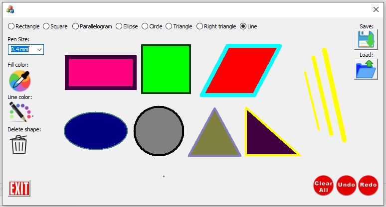

# Object Oriented Painter Project
------------------
A painter application that allows you to create/delete shapes, choose line/fill color, choose line thickness, save the drawing and reopen it.

------------------

